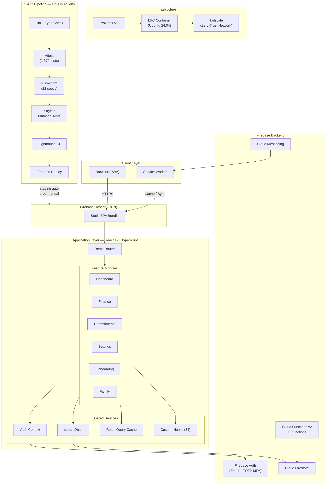
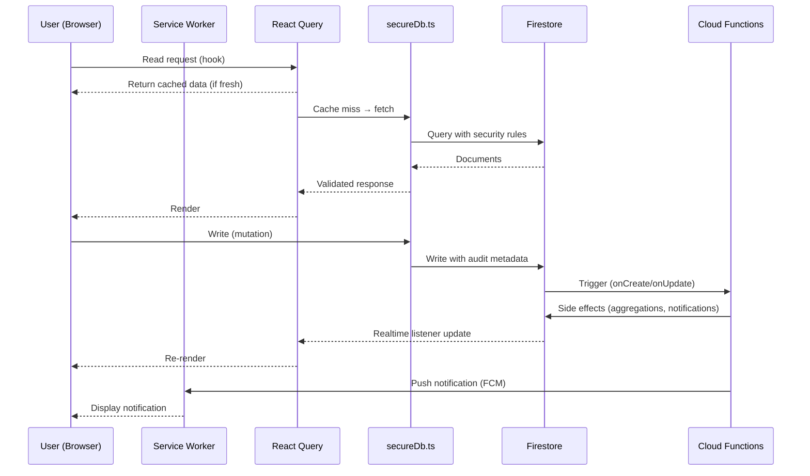
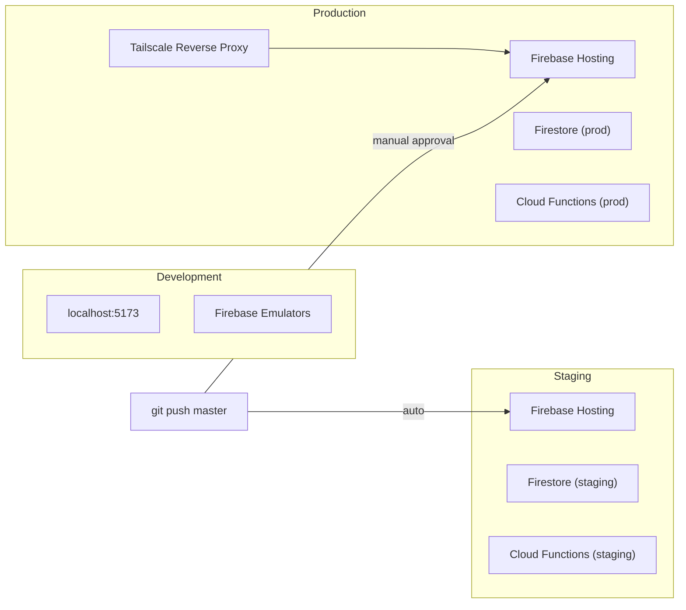

# Architecture Diagram

> High-level system architecture for Anchor OS.

## System Overview

```mermaid
graph TB
    subgraph Clients["Client Layer"]
        Browser["Browser (PWA)"]
        SW["Service Worker"]
    end

    subgraph Hosting["Firebase Hosting (CDN)"]
        SPA["Static SPA Bundle"]
    end

    subgraph App["Application Layer — React 19 / TypeScript"]
        Router["React Router"]

        subgraph Features["Feature Modules"]
            Dashboard["Dashboard"]
            Finance["Finance"]
            Commitments["Commitments"]
            Settings["Settings"]
            Onboarding["Onboarding"]
            Family["Family"]
        end

        subgraph Shared["Shared Services"]
            AuthCtx["Auth Context"]
            SecureDB["secureDb.ts"]
            QueryClient["React Query Cache"]
            Hooks["Custom Hooks (34)"]
        end
    end

    subgraph Firebase["Firebase Backend"]
        Auth["Firebase Auth\n(Email + TOTP MFA)"]
        Firestore["Cloud Firestore"]
        Functions["Cloud Functions v2\n(16 functions)"]
        FCM["Cloud Messaging"]
    end

    subgraph Infra["Infrastructure"]
        Proxmox["Proxmox VE"]
        LXC["LXC Container\n(Ubuntu 24.04)"]
        Tailscale["Tailscale\n(Zero-Trust Network)"]
    end

    subgraph CI["CI/CD Pipeline — GitHub Actions"]
        Lint["Lint + Type Check"]
        Unit["Vitest\n(1 379 tests)"]
        E2E["Playwright\n(22 specs)"]
        Mutation["Stryker\nMutation Tests"]
        LHCI["Lighthouse CI"]
        Deploy["Firebase Deploy"]
    end

    Browser -->|HTTPS| SPA
    SW -->|Cache / Sync| SPA
    SPA --> Router
    Router --> Features

    Features --> AuthCtx
    Features --> SecureDB
    Features --> QueryClient
    Features --> Hooks

    AuthCtx --> Auth
    SecureDB --> Firestore
    Functions --> Firestore
    FCM --> SW

    Lint --> Unit --> E2E --> Mutation --> LHCI --> Deploy
    Deploy -->|staging auto\nprod manual| Hosting

    LXC --> Tailscale
    Proxmox --> LXC
```

## Data Flow

```mermaid
sequenceDiagram
    participant U as User (Browser)
    participant SW as Service Worker
    participant RQ as React Query
    participant SDB as secureDb.ts
    participant FS as Firestore
    participant CF as Cloud Functions

    U->>RQ: Read request (hook)
    RQ-->>U: Return cached data (if fresh)
    RQ->>SDB: Cache miss → fetch
    SDB->>FS: Query with security rules
    FS-->>SDB: Documents
    SDB-->>RQ: Validated response
    RQ-->>U: Render

    U->>SDB: Write (mutation)
    SDB->>FS: Write with audit metadata
    FS->>CF: Trigger (onCreate/onUpdate)
    CF->>FS: Side effects (aggregations, notifications)
    FS-->>RQ: Realtime listener update
    RQ-->>U: Re-render

    CF->>SW: Push notification (FCM)
    SW-->>U: Display notification
```

## Deployment Environments

```mermaid
graph LR
    subgraph Dev["Development"]
        Local["localhost:5173"]
        Emulators["Firebase Emulators"]
    end

    subgraph Staging["Staging"]
        StagingHost["Firebase Hosting"]
        StagingFS["Firestore (staging)"]
        StagingFn["Cloud Functions (staging)"]
    end

    subgraph Prod["Production"]
        ProdHost["Firebase Hosting"]
        ProdFS["Firestore (prod)"]
        ProdFn["Cloud Functions (prod)"]
        TS["Tailscale Reverse Proxy"]
    end

    Push["git push master"] -->|auto| StagingHost
    Push -->|manual approval| ProdHost
    TS --> ProdHost
```
